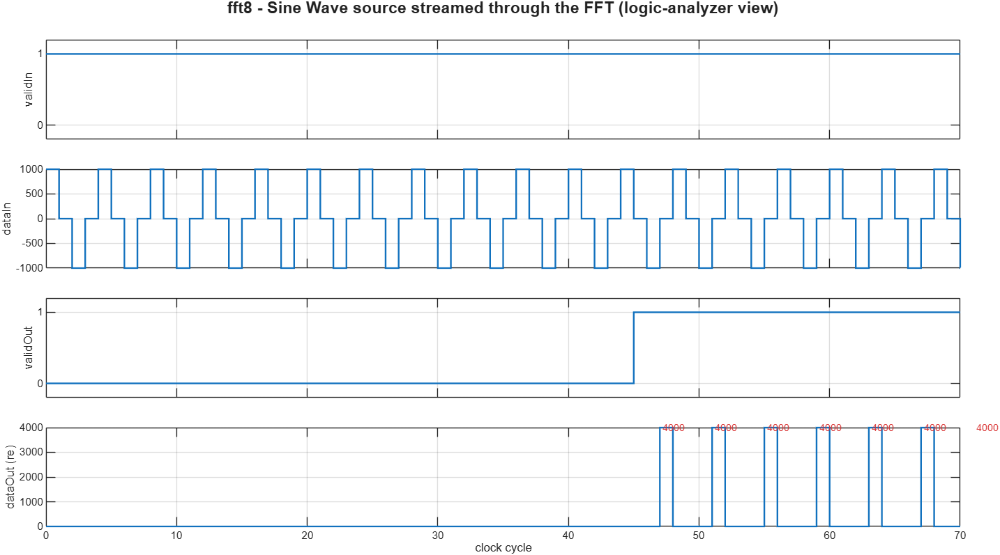

# FFT in RTL — hand-written VHDL vs one Simulink block

> Why use Simulink for hardware? This folder answers it with the design engineers reach for the moment a project gets real: the **FFT**. The *same* 8-point FFT is built two ways, given the *same* input, and shown to produce the *same* output — but one took ~160 lines of hand-written VHDL (and only does 8 points), while the other is a single library block that generates **4,456 lines** of production streaming RTL on one click.

## The story

**1. "How do you write an FFT in RTL?"**
You can't just type `y = fft(x)`. In hardware you hand-build a butterfly network: bit-reversed input ordering, hard-coded twiddle factors, complex fixed-point multiply/add, careful bit-growth, and a testbench to prove it. The [`AMD/`](AMD) folder does exactly that for an 8-point FFT — and it is already ~160 lines of dense VHDL for the *smallest useful* transform. Doubling to 16 or 1024 points means rewriting the whole thing.

**2. "…or you drop in one block."**
In [`MathWorks/`](MathWorks), the entire transform is the DSP HDL Toolbox **FFT** block. Set `FFTLength = 8`. Done. Changing it to 1024 points is one parameter, not a rewrite.

**3. Same input → same output.**
Both are driven with a real tone `x[n] = 1000·cos(2π·2n/8) = 1000·[1,0,-1,0,1,0,-1,0]`, whose FFT is a clean pair of peaks:

| bin | 0 | 1 | **2** | 3 | 4 | 5 | **6** | 7 |
|-----|---|---|-------|---|---|---|-------|---|
| MATLAB `fft` (golden) | 0 | 0 | **4000** | 0 | 0 | 0 | **4000** | 0 |
| hand-written VHDL      | 0 | 0 | **4000** | 0 | 0 | 0 | **4000** | 0 |
| Simulink FFT block     | 0 | 0 | **4000** | 0 | 0 | 0 | **4000** | 0 |

**4. One click → generate HDL.**
`makehdl` turns the block into synthesizable VHDL — a real streaming radix-2² architecture with SDF commutators, a twiddle ROM, a complex multiplier, control logic and RAM:

| | hand-written (`AMD/`) | generated from Simulink (`MathWorks/hdlsrc/`) |
|---|---|---|
| VHDL | **160 lines**, 2 files | **4,456 lines**, 16 files |
| FFT length | 8 only (fixed by the code) | any power of 2 (one parameter) |
| Architecture | combinational butterflies | pipelined streaming radix-2² |
| You wrote | all of it | none of it |

**5. Verify each the native way.**
- **Hand-written** → a VHDL **testbench** ([`AMD/fft8_tb.vhd`](AMD/fft8_tb.vhd)), simulated in Vivado xsim → `TEST PASSED`.
- **Simulink** → a **Sine Wave** source drives the FFT and **Scopes** show the result (no hand-typed input vector); a **Logic Analyzer** view shows the streaming signals; and HDL Coder's auto-generated testbench checks the *generated* VHDL against the model → `TEST COMPLETED (PASSED)`.

The Sine Wave is set so each 8-sample frame is exactly `[1000, 0, -1000, 0, 1000, 0, -1000, 0]` — **the same input the AMD testbench uses** — so the two flows are driven identically.



*`validIn` held high streams the cosine `dataIn` continuously; after the pipeline latency `validOut` goes high and each output frame on `dataOut` shows the two spectral peaks of `4000` (bins 2 and 6) — the same `[0,0,4000,0,0,0,4000,0]` the hand-written core produces.*

## Why this is the value of Simulink

- **Design at the algorithm level, not the gate level.** You think in "FFT of a tone," not in bit-reversed twiddle multiplies.
- **The generated RTL is production-grade and scalable.** 8 → 1024 points is a parameter, not a rewrite; the streaming architecture, pipelining and RAM come for free.
- **Verification is unified.** The same model is the golden reference, the simulation, the Logic Analyzer stimulus, *and* the source of an automatically generated self-checking HDL testbench.
- **It still meets hardware.** The generated VHDL is bit-true to the model and drops straight into Vivado — exactly the flow used elsewhere in this repo for the LED design.

The hand-written FFT is not "wrong" — it is a perfectly good 8-point core. The point is the effort curve: every increase in size, precision, or throughput is manual RTL work by hand, and one block parameter with Simulink.

## Repository layout

```
FFT_Comparison/
├── AMD/                       Hand-written VHDL (the "hard way")
│   ├── fft8_pkg.vhd            8-point radix-2 DIT FFT: butterflies + twiddles
│   ├── fft8.vhd               clocked wrapper (valid_in -> valid_out)
│   ├── fft8_tb.vhd            self-checking testbench (tone -> peaks at bins 2,6)
│   └── run_sim.bat            compile + simulate in Vivado xsim
│
├── MathWorks/                 Model-based (the "easy way")
│   ├── fft8.slx               one FFT block + streaming stimulus + logging
│   └── hdlsrc/fft8/           VHDL generated by HDL Coder (16 files) + HDL testbench
│
└── docs/images/               figures used in this README
```

## Reproduce it

**Hand-written (needs Vivado 2024.1):**
```
FFT_Comparison\AMD\run_sim.bat
```
Prints the 8 FFT bins and `TEST PASSED`.

**Simulink (needs MATLAB R2026a + DSP HDL Toolbox + HDL Coder):**
```matlab
cd FFT_Comparison/MathWorks
open_system('fft8'); sim('fft8');          % simulate; open the Logic Analyzer to view signals
makehdl('fft8/fft8_dut');                   % generate the VHDL
makehdltb('fft8/fft8_dut');                 % generate a self-checking HDL testbench
```
Then run the generated VHDL testbench in xsim (see `MathWorks/hdlsrc/fft8/run_gen_sim.bat`) → `TEST COMPLETED (PASSED)`.

## Notes

- Input is a real signal (imaginary part 0), a common spectrum-analysis case; both cores carry full complex arithmetic internally.
- The two implementations are **functionally** equivalent (both match the golden `fft` for this input); they are not bit-identical, because they use different architectures, scaling and rounding — which is exactly the trade-off space Simulink lets you explore by changing block options instead of rewriting RTL.
